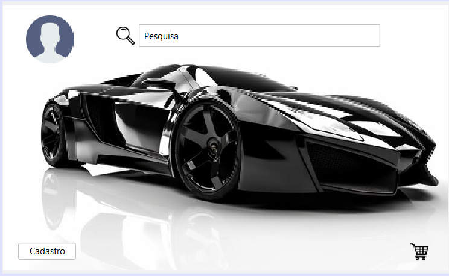
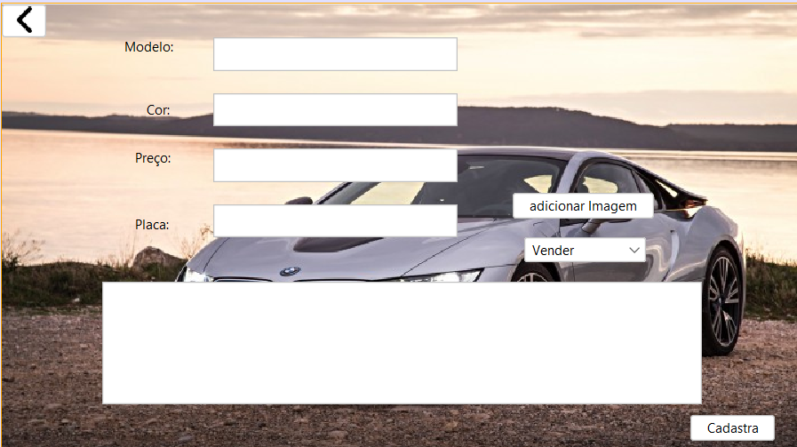

 Nessa tela quando o usuario aperta no butão cadastro ele será enviado pra tela de cadastro diretamente,
quando ele clica em algum card do carro aparecera as informaçoes dele alem de um butão de compra e não compra, 
quando apertam no butão compra o sistema vai gerar um PDF onde aparecera que o usuario comprou o carro
mas squando apertam em não compra ele sair da tela.

Na tela cadastro, o cadastro so funcionara se o usuario prencer todas as informações que se pedem se não o cadastro dará erro 
altomaticamente, no butão adiciona imagem o usuario será direcionado a uma pequena tela flutuante em que o usuario poder esta a
pegar suas proprias imagens para termina de preencer as informações que se pedem, quando o cadastro for finalizado o sistema avisara
que o cadastro foi realizado com sucesso, e os dados que o usuario colocou no cadastro estara aparecendo altomaticamente na tela principal.
